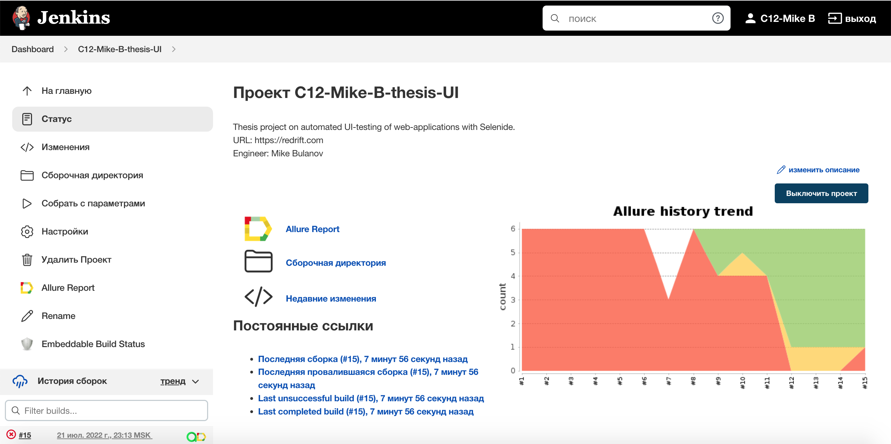
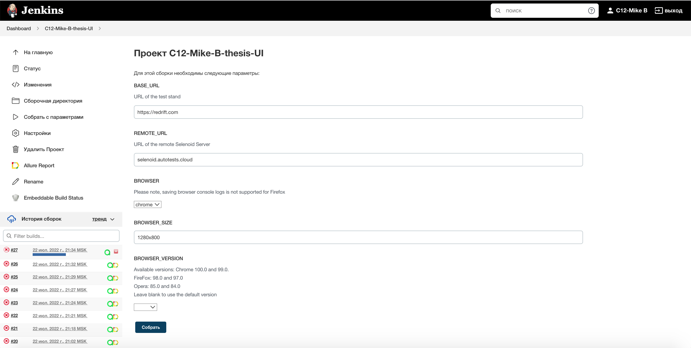
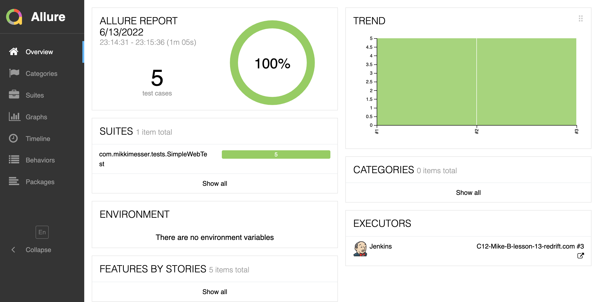
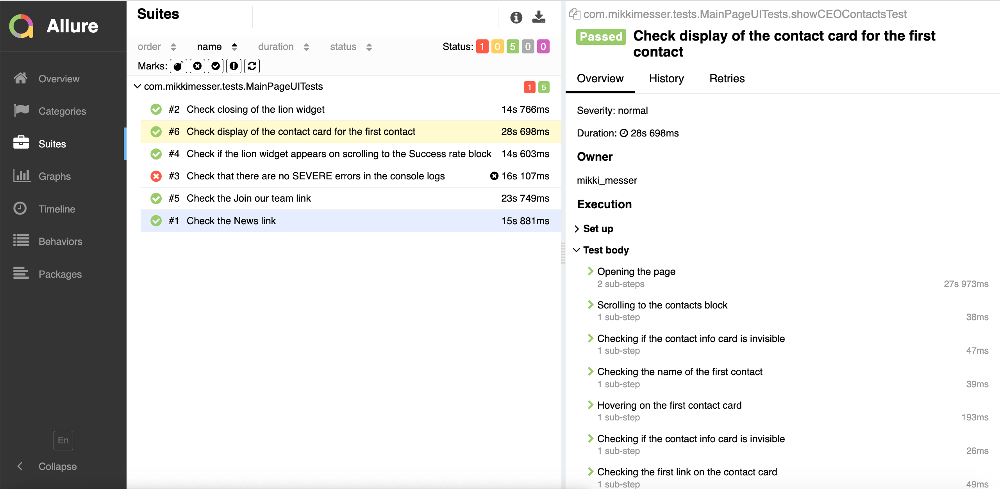
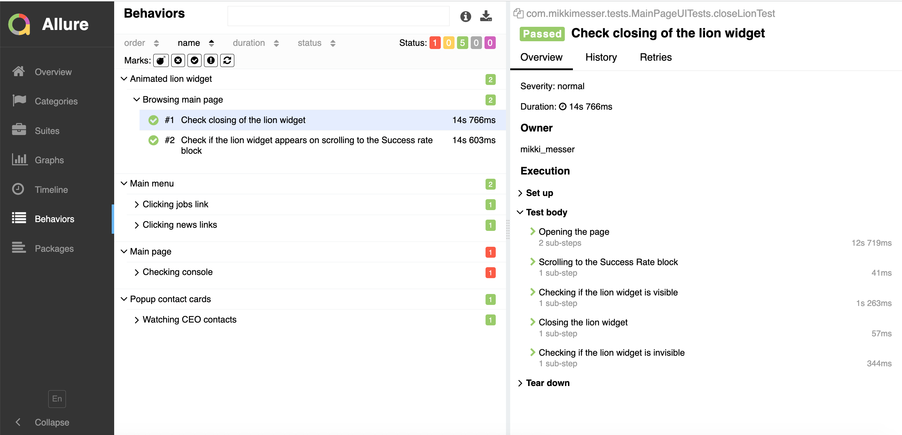
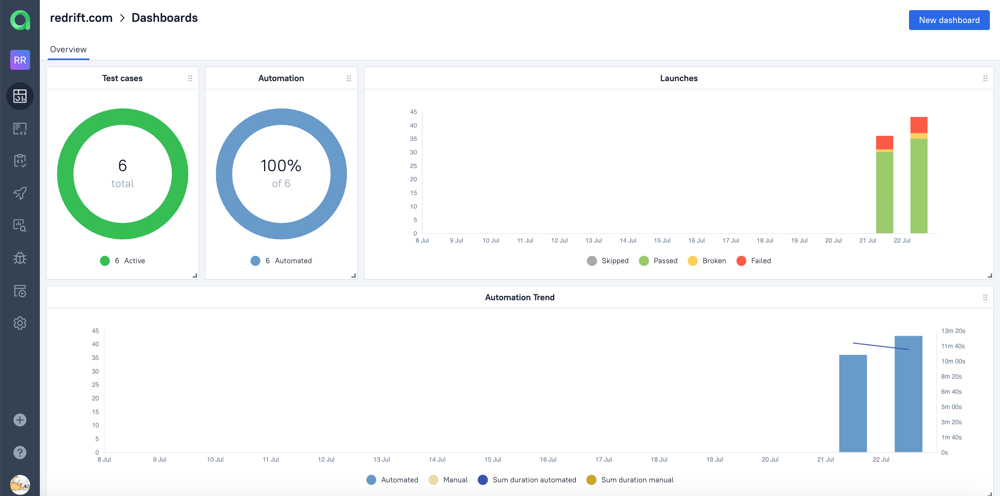
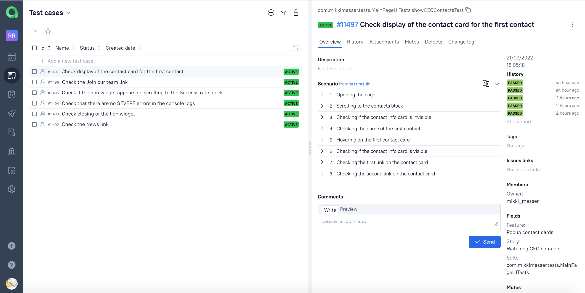
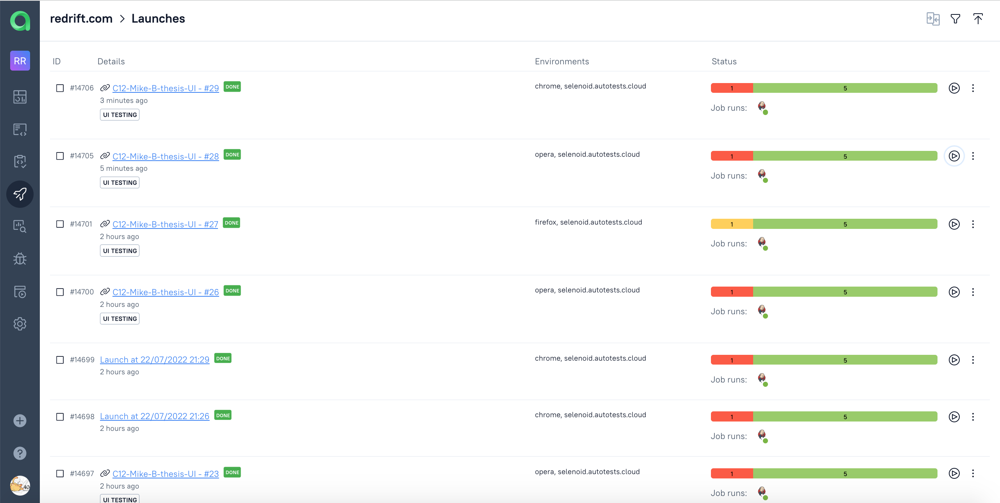
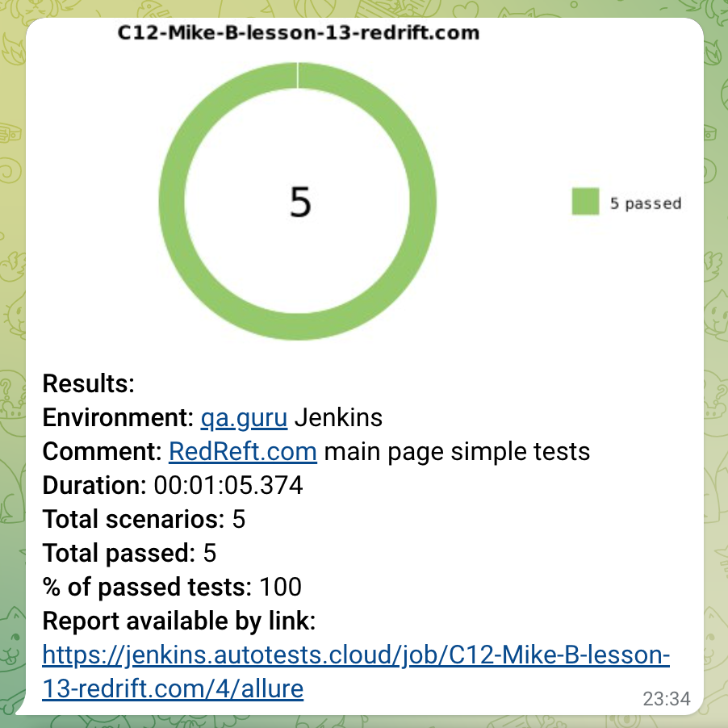
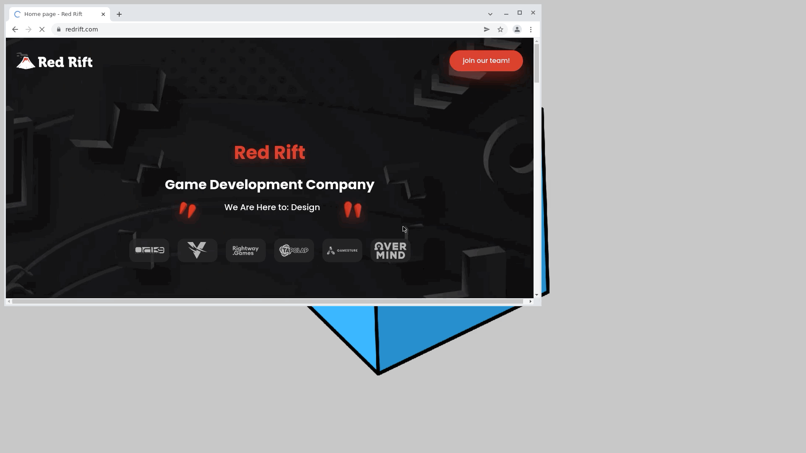

# Automated tests for the RedRift.com main page

## <a href = "https://redrift.com" target ="_blank">redrift.com</a>

## :rescue_worker_helmet: Contents

- <a href="#rescue_worker_helmet-coverage">Coverage</a>
- <a href="#rescue_worker_helmet-technology-stack">Technology stack</a>
- <a href="#rescue_worker_helmet-prepare-test-data">Prepare test data</a>
  - <a href=#testdataproperties-file-example>TestData.properties file example</a>
- <a href="#rescue_worker_helmet-launch">Launch</a>
  - <a href="#how-to-launch-on-the-local-machine-with-tests-running-locally">How to launch on the local machine with tests running locally</a>
    - <a href="#launch-with-the-default-params">Launch with the default params</a>
    - <a href="#launch-with-the-arbitrary-params">Launch with the arbitrary params</a>
  - <a href="#how-to-launch-on-the-local-machine-with-tests-running-on-the-remote-server">How to launch on the local machine with tests running on the remote server</a>
    - <a href="#environment-properties-file-example">Environment .properties file example</a>
    - <a href="#launch-with-the-default-params-1">Launch with the default params</a>
    - <a href="#launch-with-the-arbitrary-params-1">Launch with the arbitrary params</a>
  - <a href="#how-to-launch-remotely-on-jenkins">How to launch remotely on Jenkins</a>
    - <a href="#environment-properties-file-example-1">Environment .properties file example</a>
    - <a href="#launch-with-the-arbitrary-params-on-Jenkins">Launch with the arbitrary params on Jenkins</a>
    - <a href="#rescue_worker_helmet-jenkins-build-example">Jenkins build example</a>
- <a href="#rescue_worker_helmet-allure-reports-integration">Allure reports integration</a>
  - <a href="#overview">Overview</a>
  - <a href="#test-suites">Test suites</a>
  - <a href="#behaviors">Behaviors</a>
- <a href="#rescue_worker_helmet-allure-testops-integration">Allure TestOps integration</a>
  - <a href="#dashboards">Dashboards</a>
  - <a href="#test-cases">Test cases</a>
  - <a href="#launches">Launches</a>
- <a href="#rescue_worker_helmet-telegram-notifications">Telegram Notifications</a>
- <a href="#rescue_worker_helmet-selenoid-launch-example">Selenoid launch example</a>

## :rescue_worker_helmet: Coverage

- Check that the "Join our team" link opens the "Jobs" page
- Check that the "News" link opens the "Blog & News" page
- Check that on scrolling down to the "100% Success Rate" block the lion widget appears
- Check that the lion widget disappears after the click on the close button
- Check that the contact card with links to the Facebook and LinkedIn appears on mouse hover over the first contact in
  the "Team block"
- Check that there are no errors in the browser console logs

## :rescue_worker_helmet: Technology stack

<p align="center">


</p>

## :rescue_worker_helmet: Prepare test data

The test data is passed via the `src/test/resources/configuration/testData.properties` file

Required test data:
- `newsPageHeaderText` - String. Required for the Check the News link test. The header of the /news page.
- `jobsPageHeaderText` - String. Required for the Check the Jobs link and Check the Join our team link tests. The header of the /jobs page.
- `firstURLOfTheFirstContact` - String. Required for the Check display of the contact card for the first contact test. The first link in the contact card of the first contact in the Contacts block.
- `secondURLOfTheFirstContact` - String. Required for the Check display of the contact card for the first contact test. The second link in the contact card of the first contact in the Contacts block.
- `nameOfTheFirstContact` - String. Required for the Check display of the contact card for the first contact test. The name the contact card of the first contact in the Contacts block.
- `errorName` - String. Required for the Check that there are no errors in the console logs. The text of the error to look for.

### TestData.properties file example

```
newsPageHeaderText=Blog & News
jobsPageHeaderText=Red Rift Awaits You Stranger
firstURLOfTheFirstContact=https://facebook.com/Denis.Puhleacov
secondURLOfTheFirstContact=https://www.linkedin.com/in/denis-puhleacov/
nameOfTheFirstContact=Denis P.
errorName=SEVERE
```

## :rescue_worker_helmet: Launch

### How to launch on the local machine with tests running locally

#### Launch with the default params:

- browser: chrome
- browser size: 1280x800
- browser version: not specified
- baseURL: https://redrift.com

Command:

```
gradle clean test
```

#### Launch with the arbitrary params

Pass the arbitrary params via System properties.

```
gradle clean test -"Dbrowser=yourPreciousBrowser" -"DbrowserSize=AAAAxBBBB" -"DbrowserVersion=XXX.Y" -"DbaseURL=https://staging.redrift.com"
```
### How to launch on the local machine with tests running on the remote server

> Create the `.properties` file with any given name in the `src/test/resources/configuration/` folder with the
login and password to the Selenoid server and with the boolean parameter isRemote set to "true".
You can include the URL of the remote server in the `remoteURL` field as well. It might be useful 
if you have several remote servers and want to switch between them specifying the environment as a parameter.

#### Environment .properties file example

The "login", "password" and "isRemote" fields are mandatory, remote URL might be omitted and passed via 
System properties.

```
isRemote=true
remoteURL=myselenoid.example.com
login=myAwesomeLogin
password=mySecurePassword
```

#### Launch with the default params

Pass the name of your .properties file via the `environment` system property. For instance, if your `.properties` file's is
`remote.properties` launch command will be:

```
gradle clean test -"Denvironment=remote"
```

#### Launch with the arbitrary params

Pass the arbitrary params via System properties. Put the name of your .properties file to the `environment` system property.
For instance, if your `.properties` file's is `remote.properties` launch command will be:
```
gradle clean test -"Dbrowser=yourPreciousBrowser" -"DbrowserSize=AAAAxBBBB" -"DbrowserVersion=XXX.Y" -"DbaseURL=https://staging.redrift.com" -"Denvironment=remote"
```

### How to launch remotely on Jenkins

> Create the `testData.properties` file in the `src/test/resources/configuration/` folder following instructions from <a href="#rescue_worker_helmet-prepare-test-data">here</a>.

> Create the `.properties` file with any given name in the `src/test/resources/configuration/` folder with the
login and password to the Selenoid server and with the boolean parameter isRemote set to "true".
You can include the URL of the remote server in the `remoteURL` field as well. It might be useful
if you have several remote servers and want to switch between them specifying the environment as a parameter.

#### Environment .properties file example

The "login", "password" and "isRemote" fields are mandatory, remote URL might be omitted and passed via
System properties.

```
isRemote=true
remoteURL=myselenoid.example.com
login=myAwesomeLogin
password=mySecurePassword
```

#### Launch with the arbitrary params on Jenkins

Jenkins build params

- environment - name of the `.properties` file with credentials to the remote Selenoid server.
- baseURL - the URL of the web-application to test.
- remoteURL - the URL of the Selenoid instance to run tests on. Might be passed via the `environment.properties` file.
- browser - the browser.
- browserSize - the size of the browser window in AAAAxBBBB format.
- browserVersion - the version of the browser. 

Pass the name of your .properties file via the `environment` system property. For instance, if your `.properties` file's is
`remote.properties` launch command will be:

```
clean
test
-"Denvironment=remote"
-"DbaseURL=${BASE_URL}"
-"DremoteURL=${REMOTE_URL}"
-"Dbrowser=${BROWSER}"
-"DbrowserSize=${BROWSER_SIZE}"
-"DbrowserVersion=${BROWSER_VERSION}"
```

## :rescue_worker_helmet: Jenkins build example

### <a target="_blank" href="https://jenkins.autotests.cloud/job/C12-Mike-B-thesis-UI/">Jenkins build</a>

<p align="center">

</p>

<p align="center">

</p>


## :rescue_worker_helmet: Allure reports integration

### Overview

<p align="center">

</p>

### Test Suites

<p align="center">

</p>

### Behaviors

<p align="center">

</p>

> Please note, saving browser console logs to Allure reports is not supported for Firefox!!!

## :rescue_worker_helmet: Allure TestOps integration

The Jenkins job automatically sends the results of the launch to the Allure TestOps.

### Dashboards

<p align="center">

</p>

### Test cases

<p align="center">

</p>

### Launches

<p align="center">

</p>

## :rescue_worker_helmet: Telegram Notifications

> <a href="https://github.com/qa-guru/allure-notifications">qa-guru/allure-notifications</a> is used

<p align="center">

</p>

## :rescue_worker_helmet: Selenoid launch example

There is a video for each test demonstrating the flow.

<p align="center">

</p>

