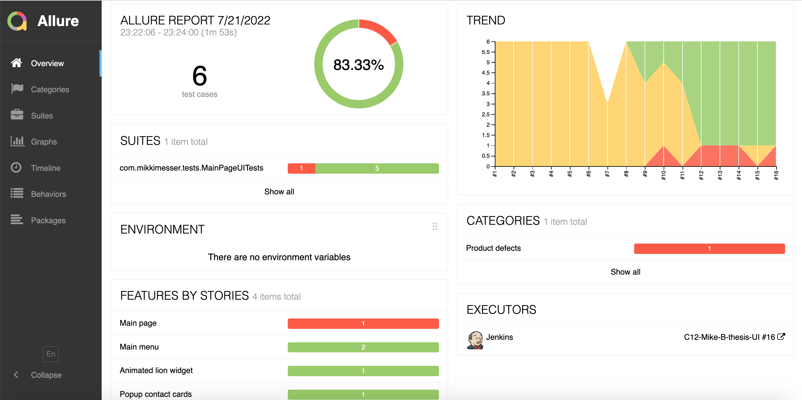
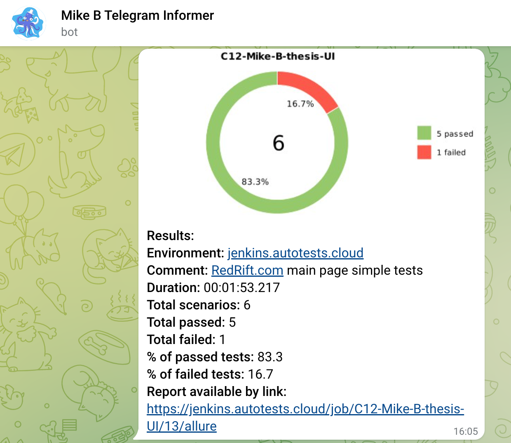

# Automated tests for the RedRift.com main page

## <a href = "https://redrift.com" target ="_blank">redrift.com</a>

## :rescue_worker_helmet: Contents

- <a href="#rescue_worker_helmet-coverage">Coverage</a>
- <a href="#rescue_worker_helmet-technology-stack">Technology stack</a>
- <a href="#rescue_worker_helmet-how-to-launch-from-the-command-line">How to launch from the command line</a>
- <a href="#rescue_worker_helmet-jenkins-build-example">Jenkins build example</a>
- <a href="#rescue_worker_helmet-allure-reports-integration">Allure reports integration</a>
- <a href="#rescue_worker_helmet-telegram-Notification">Telegram Notification</a>
- <a href="#rescue_worker_helmet-selenoid-launch-example">Selenoid launch example</a>

##  

## :rescue_worker_helmet: Coverage

- Check that the "Join our team" link opens the "Jobs" page
- Check that the "News" link opens the "Blog & News" page
- Check that on scrolling down to the "100% Success Rate" block the lion widget appears
- Check that the lion widget disappears after the click on the close button
- Check that the contact card with links to the Facebook and LinkedIn appears on mouse hover over the first contact in
  the "Team block"
- Check that there are no errors in the browser console logs

## :rescue_worker_helmet: Technology stack

<p align="center">


</p>

## :rescue_worker_helmet: How to launch from the command line

### How to launch on the local machine

<p>
Default params
</p>

- browser: chrome
- browser size: 1280x800
- remoteURL: selenoid.autotests.cloud

```
gradle clean test
```

Arbitrary params
```
gradle clean test -DselenoidURL="yourAwesomeURL" -Dbrowser="yourPreciousBrowser" -DbrowserSize="AAAAxBBBB"
```

### How to launch remotely on Jenkins

```
clean
test
-DselenoidURL=${SELENOID_URL}
-Dbrowser=${BROWSER}
-DbrowserSize=${BROWSER_SIZE}
```

### Jenkins build params

- selenoidURL - the URL of the Selenoid instance to run tests on, default value: `selenoid.autotests.cloud`
- browser - the browser, chrome, firefox, and opera are supported, default value: `chrome`
- browserSize - the size of the browser window in AAAAxBBBB format, default value: `1280x800`

> Don't forget to create the `credentials.properties` file in the `src/test/resources/configuration/` folder with the
login and password to the Selenoid

#### Credentials.properties example, put your real login and password there

```
login=myAwesomeLogin
password=mySecurePassword
```

## :rescue_worker_helmet: Jenkins build example

### <a target="_blank" href="https://jenkins.autotests.cloud/job/C12-Mike-B-lesson-13-redrift.com/">Jenkins build</a>

<p align="center">

</p>

## :rescue_worker_helmet: Allure reports integration

### Overview

<p align="center">

</p>

### Test Suites

<p align="center">

</p>

> Please note, saving browser console logs to Allure reports is not supported for Firefox!!!

## :rescue_worker_helmet: Telegram Notification example

> <a href="https://github.com/qa-guru/allure-notifications">qa-guru/allure-notifications</a> is used

<p align="center">

</p>

## :rescue_worker_helmet: Selenoid launch example

There is a video for each test demonstrating the flow.

<p align="center">

</p>

